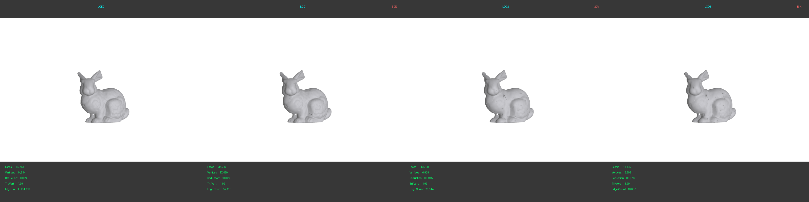
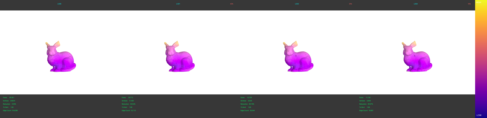
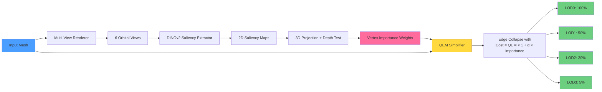

# ai-guided lod mesh simplifier

hybrid mesh simplification with qem + ai importance weighting


_Progressive LOD generation - 4 levels from 69K to 11K faces with technical metrics_

## monorepo structure

```
packages/
├── core/         # main simplification engine
├── benchmarks/   # evaluation suite
└── webapp/       # streamlit demo
```

## features

- qem simplification with ai importance modulation
- multi-view saliency extraction (dinov2/clip/vit)
- hausdorff distance evaluation
- importance heatmap visualization
- interactive web demo


_AI-detected importance weights visualized across LOD levels - hot colors (yellow) = preserved, cool colors (purple) = simplified_

## installation

```bash
# install uv
curl -LsSf https://astral.sh/uv/install.sh | sh

# sync workspace
uv sync
```

## usage

### cli

```bash
# simplify with ai
uv run ai-lod -i mesh.obj -o output/

# compare qem vs ai
uv run ai-lod -i mesh.obj -o output/ --compare

# export heatmap
uv run ai-lod -i mesh.obj -o output/ --export-heatmap
```

<!-- [cli output screenshot for metrics] -->

### web demo

```bash
uv run streamlit run packages/webapp/app.py
```

open `http://localhost:8501` in your browser.

<!-- [screenshot: webapp interface with sliders and 3d viewer] -->

### python api

```python
from core.preprocessing import load_mesh
from core.ai_importance import SaliencyExtractor, project_importance_to_vertices
from core.lod import generate_lods

mesh = load_mesh("mesh.obj")
# ... extract importance
lods = generate_lods(mesh, importance=importance, target_ratios=[0.5, 0.2, 0.05])
```

## how it works

1. render mesh from multiple viewpoints
2. extract saliency maps using dinov2
3. project 2d saliency → 3d vertex importance
4. qem collapse with modulated cost: `qem × (1 + α × importance)`
5. generate progressive lods



## license

mit
